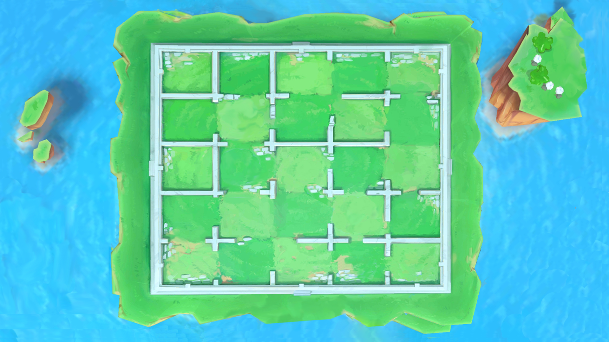

# Santorini
# Index

1. [Santorini](#santorini)
2. [Overview](#overview)
3. [About the Game](#about-the-game)
    - [Original Board Game](#original-board-game)
    - [Divine Powers (Divinities)](#divine-powers-divinities)
4. [Project Objectives and Implementation Details](#project-objectives-and-implementation-details)
    - [Team Members](#team-members)
    - [Technologies Used](#technologies-used)
    - [Files and Deployment](#files-and-deployment)
    - [UML Diagram](#uml)
    - [Usage Instructions](#usage)
5. [How to Play](#how-to-play)
    - [Step 1: Start the Server](#step-1-start-the-server)
    - [Step 2: Start the Clients](#step-2-start-the-clients)
    - [Step 3: Game Initialization](#step-3-game-initialization)
    - [Gameplay](#gameplay)
    - [Winning Conditions](#winning-conditions)
6. [Acknowledgments](#acknowledgments)

## Overview

**Santorini** is a beautiful and strategic abstract board game based on Greek mythology, where two/three players compete to be
the first to construct a three-story building and move their worker onto the top level. The game is characterized by its
simple yet deep mechanics: players alternate turns to move their worker, build structures, and leverage divine powers to
gain advantages.

In our project, we have developed a **digital version** of Santorini that enables players to experience the game in a
virtual environment. The implementation supports **full rules**, a **graphical user interface (GUI)**, and **multiplayer
functionality** over the network using socket communication. The game is designed for **1v1 (two-player)** and (1v1v1) (three-players) matches.


---

## About the Game

### Original Board Game

Originally designed by Gordon Hamilton and published by Roxley Games, **Santorini** is a strategic two/three-player game
played on a 5x5 grid. Each player controls two workers (or pawns) and aims to be the first to build their way to the
third level and move onto it.



**Key Features:**

- **Movement & Building:**
    - Players move their workers orthogonally (or diagonally depending on divine powers) and build structures on
      adjacent squares.
    - Structures can be built up to three levels, with the possibility of capping them with domes.

- **Divine Powers (God Powers):**
    - Unique special abilities granted by Greek gods (divinities).
    - Powers modify rules, movement, building, or winning conditions.
    - Each game can feature different divine powers, adding variety and strategic complexity.

### Divine Powers (Divinities)

Divinity powers significantly influence gameplay. Some examples include:

- **Apollo:** Allows building before moving.
- **Artemis:** Grants an extra turn if the player moves onto a level two or three square.
- **Minotaur:** Can move through occupied spaces.
- **Hades:** Allows winning by moving onto the third level without building.

Our implementation supports **all official divine powers**.

---

## Project Objectives and Implementation Details

### Team Members

- **Gaspare Mascolino** (team lead)
- **Alberto Leo**
- **Eugenio Facciolo**

## Technical Aspects

### Technologies Used

- **Java** as the core programming language.
- **JavaFX** for rich, interactive graphics.
- **Java Sockets** for network communication.
- **Object-Oriented Design** for clean, modular code.

### Files and Deployment

- **server-1.0.jar:** The server managing game sessions.
- **client-1.0.jar:** The client application for players.

### UML


**Usage:**

- **Build the application:**
  ```bash
  mvn clean install
  ```

- **Server:**
  ```bash
  java -jar server/target/server-1.0.jar
  ```

- **Client:**
  ```bash
  java -jar client/target/client-1.0.jar
  ```

(Connect to the server IP address and port, then start playing)

**Important**: the two clients must point to the same server's ip (default is 127.0.0.1)

---

## How to Play

1. **Start the Server:** Run the server JAR to initialize the game session manager.
2. **Start the Client:** Each player launches their client, press play, and connects to the server (E.g. 127.0.0.1).
   
   
3. **Game Initialization:** Players 1 select divinity for the game.
   
4. **Gameplay:** Players alternate turns:

   - Move their worker.
   - Build structures.
   - Use divine powers if desired.
   - The objective is to reach the third level with a worker, or fulfill other victory conditions based on divine powers.
   
5. **Winning:** The first player to meet the win conditions wins the game.
   

---

## Acknowledgments

This project has been developed as part of the **Final Year Software Engineering Course** at **Politecnico di Milano**,
showcasing skills in game development, networking, and software design.

---
